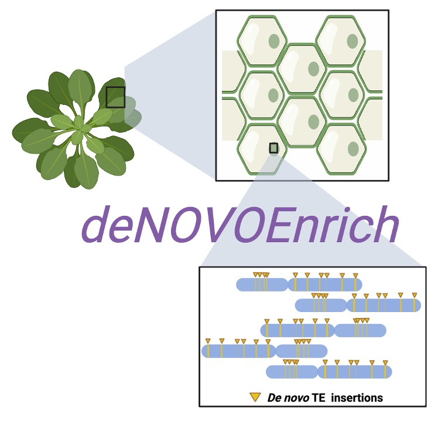

# deNOVOEnrich
Identification of _de novo_ transposon insertion sites from targeted sequencing data generated through Transposon display Sequencing (TEd-Seq)

## Overview

deNOVOEnrich is a computational pipeline developed to efficiently detect and profile genome-wide somatic transposition insertions, as well as non-reference heritable transposition events from targeted sequencing data generated through Transposon display sequencing (TEd-Seq). 

The pipeline leverages high-confidence split read alignments to identify TE: genome break sites, enabling accurate detection of bona-fide non-reference somatic and heritable new insertions of a transposon. Stringent filters were applied at several critical steps of the pipeline to ensure the removal of false positives and the reduction of background noise signal.

#### How does it work?
deNOVOEnrich processes raw paired-end reads sequentially to ultimately pinpoint the genomic location of novel transposon insertion sites at base resolution. The primary stages of the pipeline have been outlined below:

 - #### Retrieval of TE-specific reads from raw sequencing reads 
To enrich for reads of interest, the pipeline uses a short extremity sequence (~40-60bp, typically from the long terminal repeat or LTR) of the targeted transposable element (TE) family as a bait. This targeted screening isolates TE-specific reads from the raw sequencing data of the TEd-Seq, effectively removing the background noise and non-specific sequences. Additionally, we filter low-quality and sequencing artefacts.

- #### Generate longer contigs
High-quality paired-end reads are merged to generate longer contigs, facilitating accurate identification of transposon insertion-genome split sites. 

 - #### Mapping to reference genome and detection of unique/split (soft-clipped) alignments
Assembled contigs are aligned to the reference genome in local alignment mode to enable split-read mapping. The resulting alignments are then filtered to retain only unique and split (soft-clipped) alignments wherein the split region is at least ~40nt in length. 

- #### Mapping to targeted TE extremity
In parallel, the assembled contigs are also aligned to the extremity sequence of the targeted TE family using local alignment mode, and TE-specific alignments are retrieved.

- #### Tagging Alignments
In this crucial step, the alignments to the reference genome and targeted TEs are collated to preserve split contigs with shared read homology between the target TE and reference genomic sites. The TE read-tagged alignments are then used for calling new insertion sites.

- #### Calling non-reference somatic and heritable transposition events
Novel TE insertions are classified as either _de novo_ somatic or heritable (segregating) transposition events based on read depth at the insertion sites. All new insertion events marked by a read coverage of ≤5 (default) are regarded as somatic events, while TE insertions with a threshold of ≥30 reads (default) were classified as heritable transpositions. The cutoff thresholds used to define somatic and heritable TE insertions can be adjusted by the user based on the read coverage distribution (Highly recommended). The identified putative insertions are filtered stringently to remove ambiguous events.

Further details of the pipeline can be found in Ambreen et al. 

## Installation & Requirements
deNOVOEnrich is executed through a Bash script and is designed for command-line use on Unix-based systems. It does not need compilation. To install, simply clone the bash script and ensure that the main script is executable.

- Linux 86X64 Systems
- cutadapt (https://cutadapt.readthedocs.io/en/stable/)
- fastp (https://github.com/OpenGene/fastp)
- seqtk (https://github.com/lh3/seqtk)
- trimmomatic (http://www.usadellab.org/cms/?page=trimmomatic)
- PEAR (https://github.com/tseemann/PEAR)
- bowtie2 (https://bowtie-bio.sourceforge.net/bowtie2/index.shtml)
- picard (https://broadinstitute.github.io/picard/)
- samtools (https://www.htslib.org/)
- bedtools (https://bedtools.readthedocs.io/en/latest/index.html)
- readtagger (https://pypi.org/project/readtagger/)

Ensure that all required dependencies are properly installed in the working environment to avoid errors during run. 

## Input files
- Raw paired-end fastq files from TEd-Seq
- Reference genome [fasta format]
- Reference TE files
  - TE extremity sequences. Two fasta files containing the TE extremity region (from the primer site to 5'LTR extremity) and its reverse complement.  
  - Known native/reference loci of the TE family [BED file]. The bed file should list genomic coordinates of the TE's native loci in the reference genome ($Chr $Start $End). These are used to filter out false positives, which often cluster near the native loci due to sequencing artifacts.
- Illumina adapter file for adapter trimming [fasta format].
- Mono-nucleotide genomic sites [BED file]. The bed file containing genomic coordinates of mononucleotide repeats can be generated by tools such as the MIcroSAtellite (MISA) identification tool (https://webblast.ipk-gatersleben.de/misa/) and further filtering to retain mononucleotide repeats.
- Illumina adapter sequences [fasta format]. e.g. TruSeq3-PE.fa

 ## Usage
<pre>bash deNOVOEnrich.sh [options]
--genome              Full path to directory containing reference genome FASTA
--ref_TE              Full path to directory with TE-specific FASTA and BED files (e.g., AtCopia93_loci.bed)
--rawRead1            Path to raw paired-end Read 1 FASTQ file (FASTQ)
--rawRead2            Path to raw paired-end Read 2 FASTQ file (FASTQ)
--Sample              Name of the sample (used in output filenames)
--adapter             Path to Illumina adapter sequences file (e.g., TruSeq3-PE.fa)
--outDir              Directory to store all output results
--TEfam               Transposon family of interest (Must match TE-specific file names e.g., Use AtCopia93 for"
           			        AtCopia93_loci.bed or AtCopia93_flanking_sequence.fa)
--somatic             Coverage threshold to call somatic insertions (Default = 5)
--heritable           Coverage threshold to call non-reference segregating insertions (Default = 30) 
--monomeric_repeat    Bed file with coordinates of monomeric repeats of reference genome
--CORES               Number of threads to use
--help | -h           Display this help message</pre>

### Example command
<pre> bash deNOVOEnrich.sh --Sample A1 --TEfam AtCopia93 --genome /path/genome.fa --ref_TE /path/TE_files --rawRead1 A1_1.fq --rawRead2 A1_2.fq --adapter /path/TruSeq3-PE.fa --somatic 5 --heritable 30 --outDir ./results --CORES 8 </pre>

## Outputs
All key results are saved in a newly generated sub-directory named **Final_outputs**, located within the user-defined output directory.
An additional sub-directory **temp** contains intermediate files generated during the pipeline run.

- #### BAM file with soft-clipped tagged alignments.
  Useful for visualization of both somatic and heritable insertions in genome browsers.
  <pre>${Sample}_${TEfam}.uniq.split.readtagged.final.bam</pre>
- #### _De novo_ somatic insertions [BED file]
  A 7-column BED file capturing all _de novo_ somatic insertions in the sample:
  <pre>${Sample}_${TEfam}.somatic_insertions.final.bed </pre> 
  Each column provides detailed information about the novel insertion site:
  - Column 1: Chromosome
  - Column 2: Start
  - Column 3: End
  - Column 4: Strand
  - Column 5: Total read coverage supporting the insertion site
  - Column 6: Total Unique Reads supporting the insertion site
  - Column 7: Distribution of PCR duplicates for each unique read
- #### Heritable or fixed insertions
  A 7-column BED file capturing all novel heritable insertions in the sample:
  <pre>${Sample}_${TEfam}.fixed_insertions.final.bed</pre> 
  The columns follow the same structure as described for somatic insertions.

 
  

